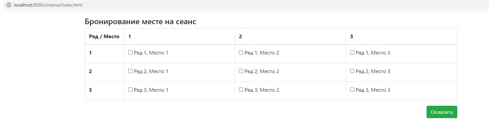
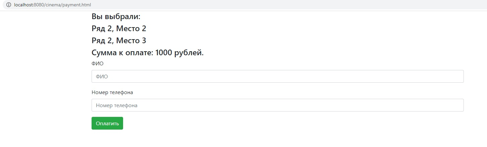
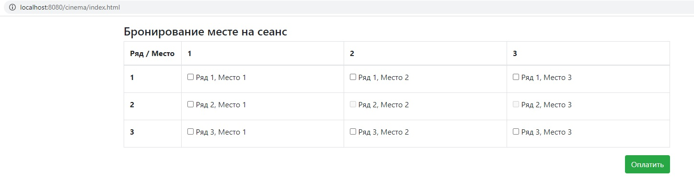

# Cinema

**О проекте:**

Проект реализует сервис по бронированию билетов в кинотеатре.

**Используемые технологии:**

- Java 14
- Java Servlets, JSP
- HTML, JavaScript, jQuery, Ajax
- Apache Tomcat
- PostgreSQL
- SLF4J with Log4
- Apache Maven
- PowerMock + Mockito

**Реализованные возможности:**

- Бронирование мест в соответствии с выбранными местами.
- Данные о бронировании сохраняются в базу данных: забронированные места, 
данные посетителя кинотеатра.
- Информация о текущем состоянии мест, а именно какие места забронированы,
а какие свободны, через заданный промежуток времени отображается на странице выбора мест.

